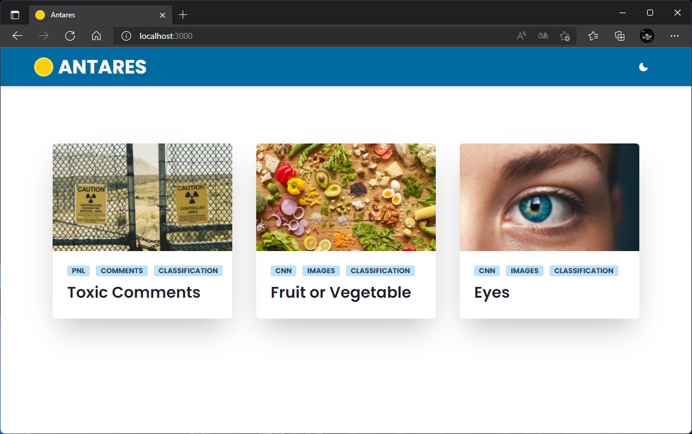
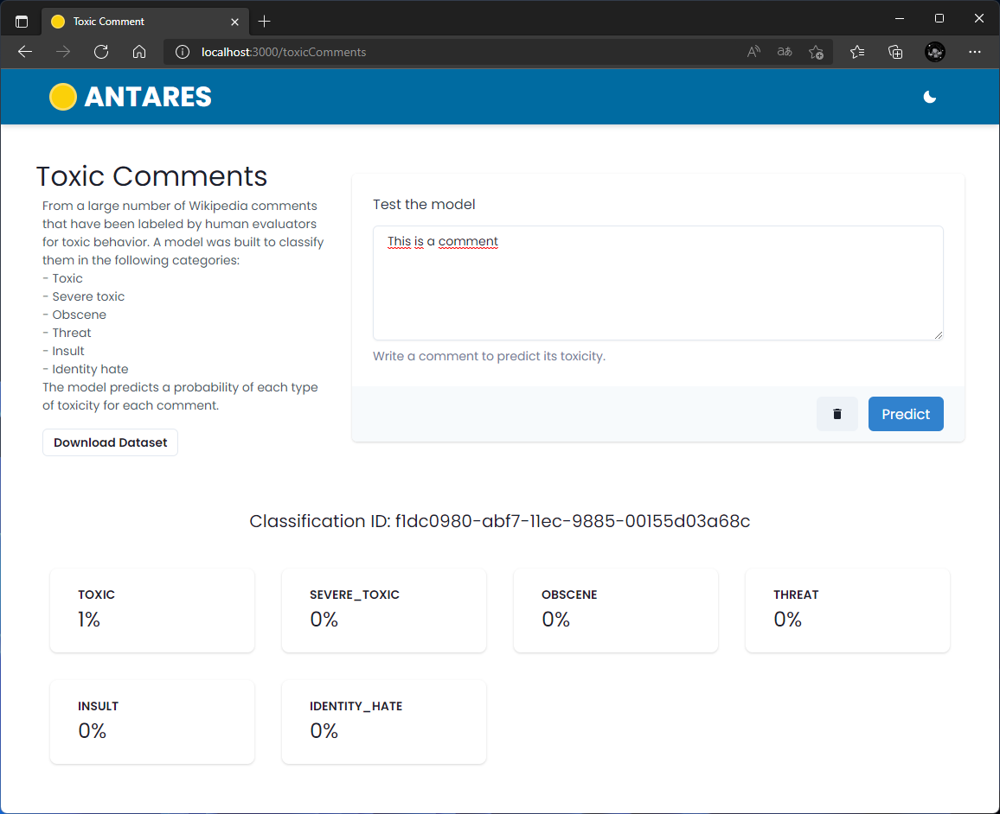
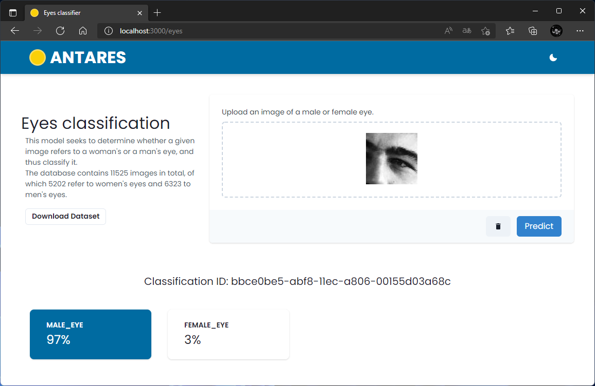

# Antares

This application is intended to serve as an example of an implementation of a model trained with machine learning and deployed in a production environment.


## Screenshots


---

---



## Backend

### API Reference

#### PNL

```http
  POST /toxic-comment/classify
```

| Parameter | Type     | Description                |
| :-------- | :------- | :------------------------- |
| `comment` | `String` | **Required** A comment (toxic comment) |

#### CNN

```http
  POST /eyes/classify
```

| Parameter | Type     | Description                       |
| :-------- | :------- | :-------------------------------- |
| `Image`      | `file` | **Required** Image of eye |

```http
  POST /fruit-or-vegetable/classify
```

| Parameter | Type     | Description                       |
| :-------- | :------- | :-------------------------------- |
| `Image`      | `file` | **Required** Image of fruit or vegetable |


## Run Locally Backend

Clone the project

```bash
  git clone https://github.com/luismateoh/Antares.git
```

Go to the project directory

```bash
  cd Antares/backend
```

Install dependencies

```bash
  pip install -r requirements.txt
```

Start the server

```bash
  uvicorn app.main:app --reload
```


## Run Locally Frontend

Clone the project

```bash
  git clone https://github.com/luismateoh/Antares.git
```

Go to the project directory

```bash
  cd Antares/frontend
```

Install dependencies

```bash
  npm install
```

Start the dev server

```bash
  npm run dev
```
## Deploy with docker
Go to the project directory

```bash
  cd Antares
```
Run the docker compose
```bash
  docker-compose up -d --build
```


## License

[MIT](https://choosealicense.com/licenses/mit/)

